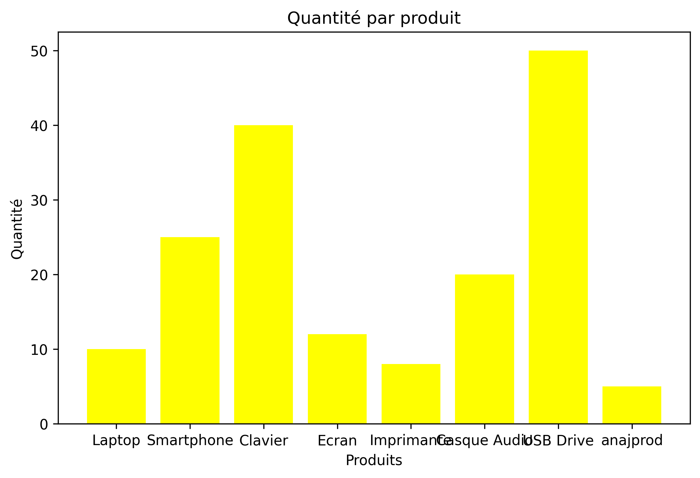
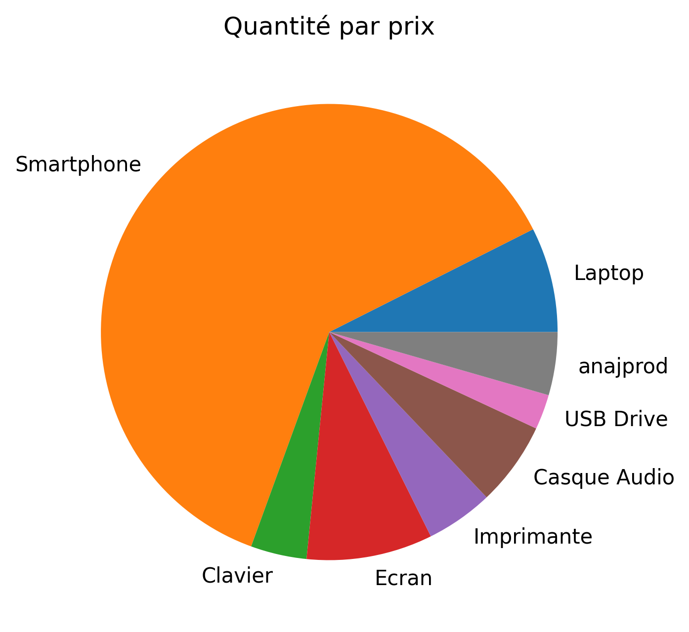

# 📦 Gestion de Stock avec Statistiques et Visualisation

## 🎯 Objectif

Ce projet a pour but de développer une application en **Python** permettant de :

- Gérer un stock de produits de manière simple.
- Calculer des statistiques de base (prix minimum, maximum, moyen, quantité totale, etc.).
- Visualiser les données grâce à des graphiques.

L’objectif est également d’adopter une approche professionnelle de gestion de projet :

- Utilisation de **Git** pour la contribution collaborative.
- Utilisation de **Jira** pour planifier et suivre les tâches.
- Respect d’une **structure de fichiers claire et modulaire**.

<div align="center">
  
  
</div>
---

## 🛠️ Technologies utilisées

- [Python](https://www.python.org/)
- [Pandas](https://pandas.pydata.org/)
- [NumPy](https://numpy.org/)
- [Matplotlib](https://matplotlib.org/)

---

## 🚀 Installation et exécution

1. **Cloner le dépôt :**
   ```bash
   git clone https://github.com/manalfarouq/Gestion_des_produits.git
   cd Gestion_des_produits
   ```
2. **Créer un environnement virtuel (optionnel mais recommandé) :**

```bash
python -m venv venv
source venv/bin/activate # Linux / macOS
venv\Scripts\activate # Windows
```

3. **Installer les dépendances :**

```bash
pip install -r requirements.txt
```

4. **Lancer l’application :**

```bash
 python main.py
```

## 📂 Structure du projet 

```bash
gestion-stock/
│── data/                # Données CSV 
│── src/                 # Code source
│   ├── stats.py         # Fonctions statistiques
│   ├── visualization.py # Fonctions de visualisation
│   ├── stock.py         # Gestion du stock
│   └── main.py          # Point d’entrée du projet
│── requirements.txt     # Dépendances
│── README.md            # Documentation


```

## 🤝 Contribution

\*\*1. Fork le projet.

```bash
**2.Créez une nouvelle branche :**
```

```bash
git checkout -b feature/ma-fonctionnalite
```

**3. Faites vos modifications et committez :**

```bash
git commit -m "Ajout de ma fonctionnalité"
```

**4.Poussez vers votre branche :**

```bash
git push origin feature/ma-fonctionnalite
```

**5.Créez une Pull Request.**

## 📊 Exemples de fonctionnalités prévues

    - Ajout, suppression et mise à jour d’un produit dans le stock.

    - Calcul des statistiques :

    - Prix minimum, maximum, moyen.

    - Quantité totale.

    - Visualisation des données :

    - Histogrammes.

    - Graphiques circulaires.

    - Évolution temporelle des stocks.
